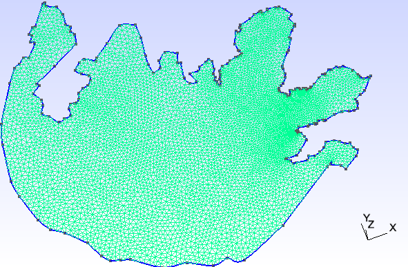

## Transferring Lake Shape To GMSH

### Lake and Island Outline

We are going to walk through the process of transferring a lake to GMSH format in this little tutorial. We are going to focus on Lake Taihu.


#### 1. Collect Lake Data

The image (along with coordinates representing lines) was generated using this [app](http://www.birdtheme.org/useful/v3tool.html). This app may not be up at the time of your access. However, this should not be a problem as all that what one needs is to generate a list of coordinates where each two consecutive coordinates in list represents a straight line that approximates the shore line of the lake. The consecutive series of these straight lines map out the boundary of the lake: 

The app generates a series of coordinates ( output stored in `transferCoordinates/mainLake.txt`):
```
120.572205,31.107037,0.0 
120.581818,31.091750,0.0 
120.589371,31.091456,0.0 
120.589371,31.087634,0.0
...
```
___
**NOTE**: Make sure your series of coordinates actually form a closed loop. The simplest way to do it is generate a list of coordinates that almost loop around the entire lake and where the first coordinate and last coordinate in your ordered list would form the last closing line in your loop. Simply copy over the first coordinate and place at the bottom of list.
___

In addition to getting points of boundary, make sure to pick a point that acts as a reference for all the others. This value of `lat0` and `lon0` will be constant througout. The easiest method is to select the first coordinates in our `mainLake.txt`.

```
lat0 = 31.107037;
lon0 = 120.572205;
```

#### 2. Clean Up Data

The data must now be cleaned up before generating GMSH data as Matlab script responsible for this needs data to be in specific format.


The data generated in this specific app is in `longitude,latitude,0.0` format. You can filter out the data to a nice format using: `awk -F ',' '{print $2 " " $1}' transferCoordinates/mainLake.txt > transferCoordinates/mainLakeSpaced.txt `. This will produce:

```
31.107037 120.572205
31.091750 120.581818
31.091456 120.589371
31.087634 120.589371
...
```

Now strip the columns and put them into individual files as rows:

`awk  '{ printf( "%s ", $1 ); } END { printf( "\n" ); }' transferCoordinates/mainLakeSpaced.txt > transferCoordinates/mainLakeLat.txt`

and then the longitude:

`awk  '{ printf( "%s ", $2 ); } END { printf( "\n" ); }' transferCoordinates/mainLakeSpaced.txt > transferCoordinates/mainLakeLon.txt`

In addition, place the values `lat0` and `lon0` into file `transferCoordinates/referenceCoord.txt` such that:
```
$ cat transferCoordinates/referenceCoord.txt
31.107037
120.572205
```

#### 3. Collect Island Data


Adding islands follows the same procedure as before. Generate the series of coordinates that wrap around island and transfer them to `transferCoordinates/island1Lat.txt` and `transferCoordinates/island1Lon.txt` (new files for each island). `lat0` and `lon0` remain unchanged within `transferCoordinates/referenceCoord.txt`. 
 
#### 4. Generating GMSH

Code within `transferCoordinates/lonlattocartesian.m` maps the coordinates to `outputFileName`. Open and modify variables in beggining of code. By opening each `outputFileName` in GMSH and selecting `Modules > Mesh > Define > 2D` a mesh will be defined. `File > Save Mesh` will save mesh to a `.msh` file matching the prefix of your `.geo` file (`$name.geo -> $name.msh`). Sample cases with their meshes:
```
%-------------------------------------------------
curveCount = 1;

outputFileName = 'noisland.geo';

%FIRST ELEMENT IN curve(Lon|Lat) MUST REPRESENT LAKE OUTLINE.
%ith index curveLon logically matches ith index of curveLat
lonFileName = {'mainLakeLon.txt', 'island1Lon.txt'};
latFileName = {'mainLakeLat.txt', 'island1Lat.txt'};

%the bigger element_size, the more coarse the mesh
element_size = 1000;

fileRefCord = fopen('referenceCoord.txt');
%-------------------------------------------------
```

```
%-------------------------------------------------
curveCount = 2;

outputFileName = 'oneisland.geo';

%FIRST ELEMENT IN curve(Lon|Lat) MUST REPRESENT LAKE OUTLINE.
%ith index curveLon logically matches ith index of curveLat
lonFileName = {'mainLakeLon.txt', 'island1Lon.txt'};
latFileName = {'mainLakeLat.txt', 'island1Lat.txt'};

%the bigger element_size, the more coarse the mesh
element_size = 1000;

fileRefCord = fopen('referenceCoord.txt');
%-------------------------------------------------
```
;

```
%-------------------------------------------------
curveCount = 6;

outputFileName = 'fiveislands.geo';

%FIRST ELEMENT IN curve(Lon|Lat) MUST REPRESENT LAKE OUTLINE.
%ith index curveLon logically matches ith index of curveLat
lonFileName = {'mainLakeLon.txt', 'island1Lon.txt','island2Lon.txt','island3Lon.txt','island4Lon.txt','island5Lon.txt'};
latFileName = {'mainLakeLat.txt', 'island1Lat.txt','island2Lat.txt','island3Lat.txt','island4Lat.txt','island5Lat.txt'};

%the bigger element_size, the more coarse the mesh
element_size = 1000;

fileRefCord = fopen('referenceCoord.txt');
%-------------------------------------------------
```


___

Take note how `curveCount` changes relative to `lonFileName` and `latFileName`.

**NOTE**: Matlab must be `R2016b` or later.
___

